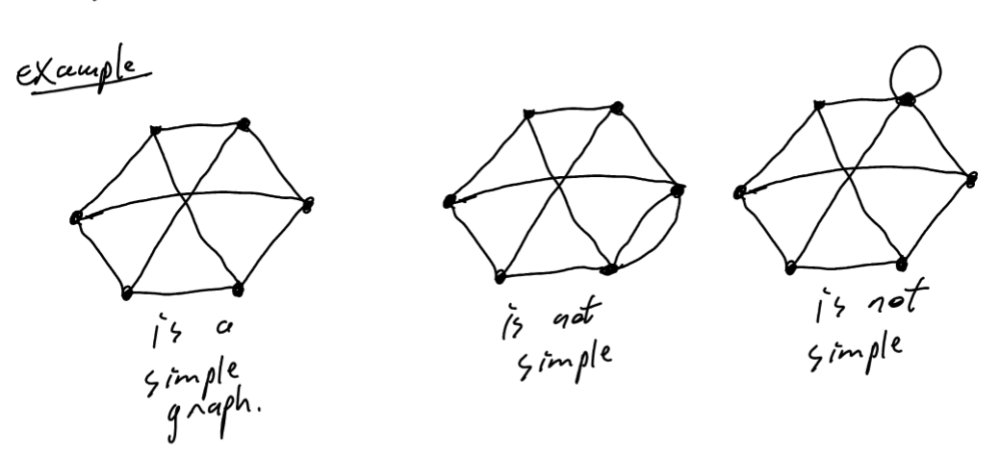
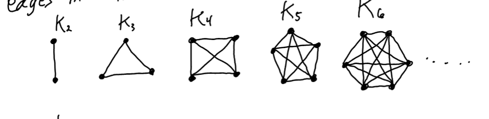
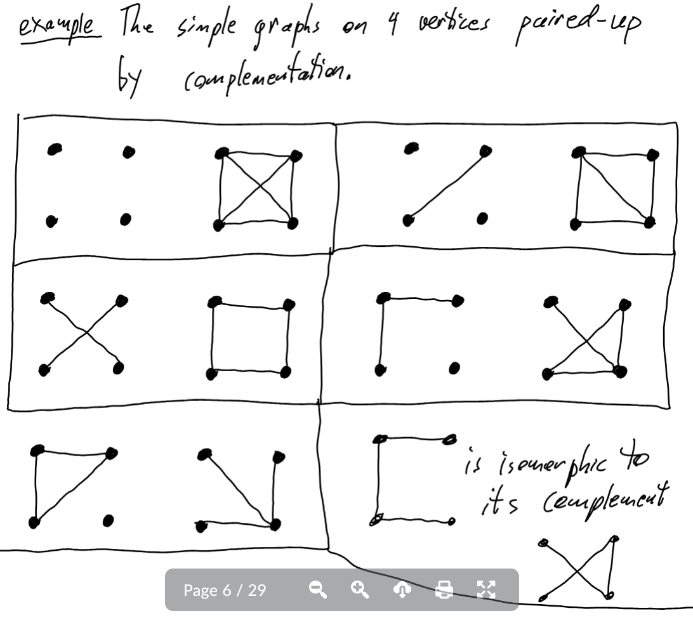
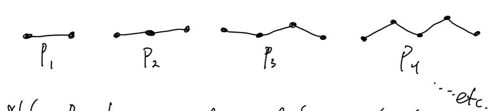
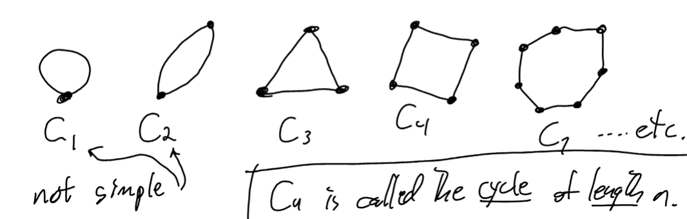
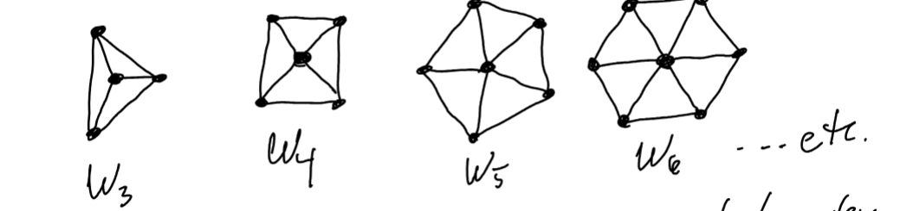
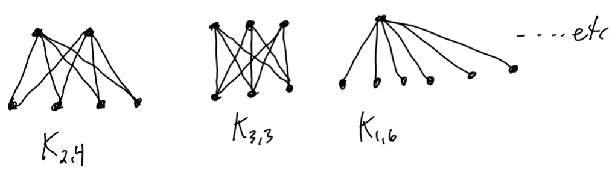
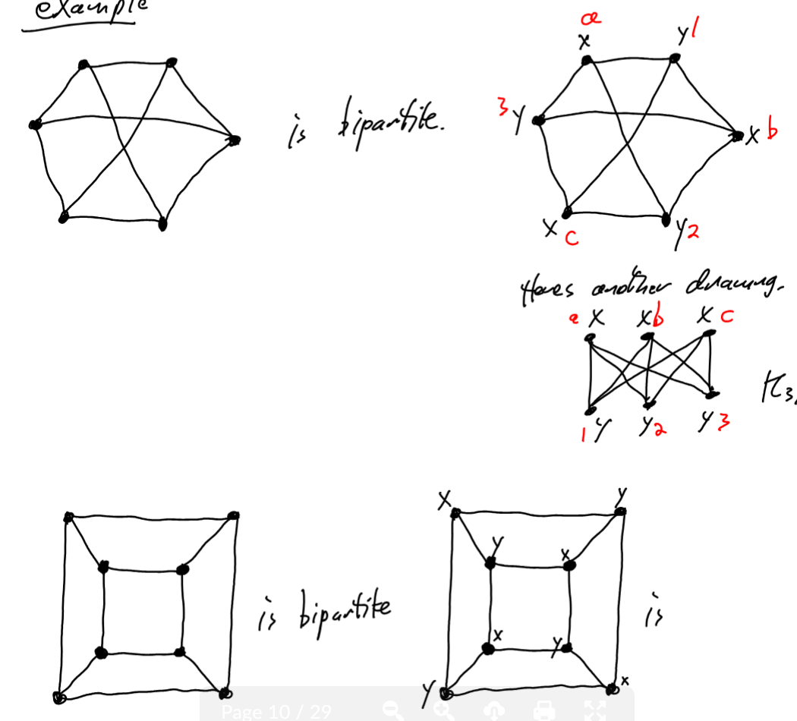
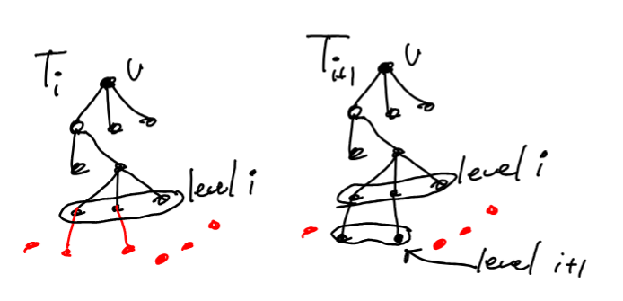

# Basics

**Graph**  
Definition: A graph (or network) is a pair of sets $G = (V(G), E(G))$ where,
- $V(G)$ is a set of vertices (sometiems called nodes)
- $E(G)$ is a set of edges where each edge is associated with a multiset of vertices with 2 elements (i.e {x,x}, {x,y} where $x,y \in V(G)$ )

**Simple**  
Definitiion: A graph is simpl when there are no loops and no multiple links between the same pair of vertices.

When a graph is simpl its edges can be ambigously associated with 2-element subsets of $V(G)$

**Isomporphic**

Definition: two graphs are isomporphic if their vertices can be labeled with the same set of labels and they result in the same edge sets.

**Complete Graph**

Definition: A complete graph $K_n$ with vertices is the simple graph with all possible edges. There are $n \choose 2$
 edges in $K_n$

 

 **Compliments**

 Definition: Given a simple graph G on n vertices its compliemnt is the grpah on the same vertex set, but whose edge set is $E(K_n) - E(G)$. This graph is denoted by $\overline G$

 

 **Paths** 
 Definition: $P_n$ is the graph with vertices $1,2,3,..., n,n+1$ and edges $\{ \{1,2\}, \{2,3\}, \ldots, \{n,n+1\} \}$

Note: $P_n$ has n edges and this number is also known as the length of the path.

**Cycles**

Definition: $C_n$ is the graph with verticies $\{1,2,3,4,5, ...,n\}$ and $$\{ \{1,2\}, \{2,3\}, \ldots, \{n-1,n\},\{n,1\}\}$$

**Wheels**

Defintion: $W_n$ is called the n-pkoed wheel

Note $W_n$ has n+1 vertices. The central vertex is called the hub and the rest are rim vertices

**Complete Bipartite Graph**

$K_m,_n$ is the graph with vertex set $\{a_1, a_2, \ldots, a_m\} \cup \{b_1, b_2, \ldots, b_n\}$ with all possible edges $\{a_i,b_i\}$

Definition: A graph B is bipartite when $V(B) = X \cup Y$ with $X \cap Y \neq 0 $ , and each edge e has one endpoint in X and one end point in Y.

The Set $X$ and $Y$ are known as the partite sets of $B$

**k-regualr**
Definition A graph G is $k-regular$ when evyer vertex has degree $k$

**Degree Sequences**

Definition: Given a simple lgraph $G$ with vertices $v_1,v_2,v_3, \ldots, v_n$ with $d(v_1) \ge d(v_2)\ge \ldots \ge d(v_n)$ the degree sequence of $G$

**Distance**  

Definition: The distance between two vertices $u,e \in V(G)$
(when G is connected) is the length of a shortest uv-path in G. This distance is denoted by $d_G(u,v)$.

**Breadth First Search (BFS)** 

Definition: is an algorithm for searching a tree data structure for a node/vertex that satisfies a given property

Input: A connected graph G and a root vertex $v\in V(G)$

Output: A spanning tree T of G rooted at v fpr which the length of the unique uv-path in T is $d_G(u,v)$ for all $u \in V(G)$. In other words BFS finds a shortest uv-path in G for all vertivse a and gives it to you int he form of a spannding tree

*Begin*

1. Let $T_0 = V$. This is a tree with one vertex where the furthest vertex from v has distance = 0.

2. Assume we hae $T_i$ which is a tree rooted at V whose vertices partition into i levels according there distance from V.

3. If $V(T_i) = V(G)$ then halt and return $T = t_i$ as a BFS spanning tree.

4. If $V(T_i) \sub V(G)$ then check each edge of G attached vertices at level i to obtain a new tree $T_i+1$ with $i+1$ levels.

    

5. Return to step 2.

Notice: BFS checks each edge in G at most pne time in its entire computation. So we say BFS has at most $|E(G)|$ edge checks.