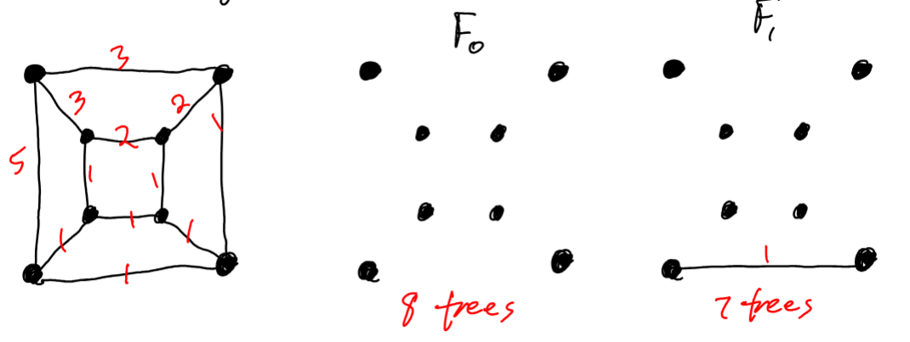
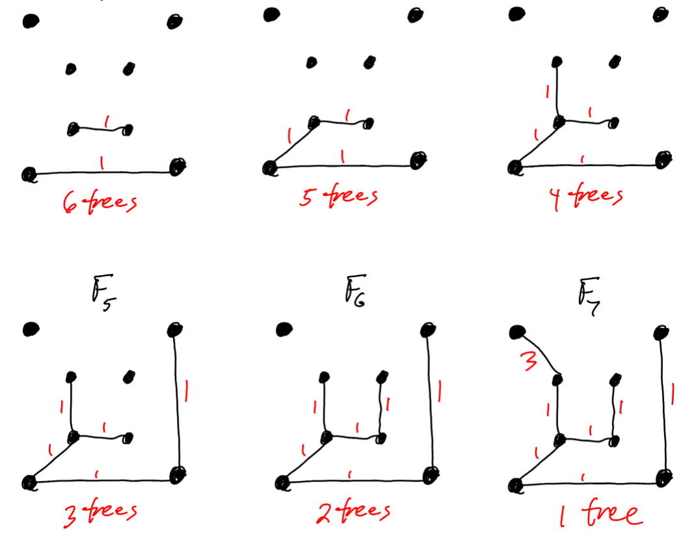
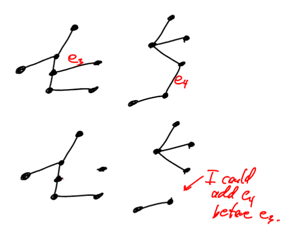
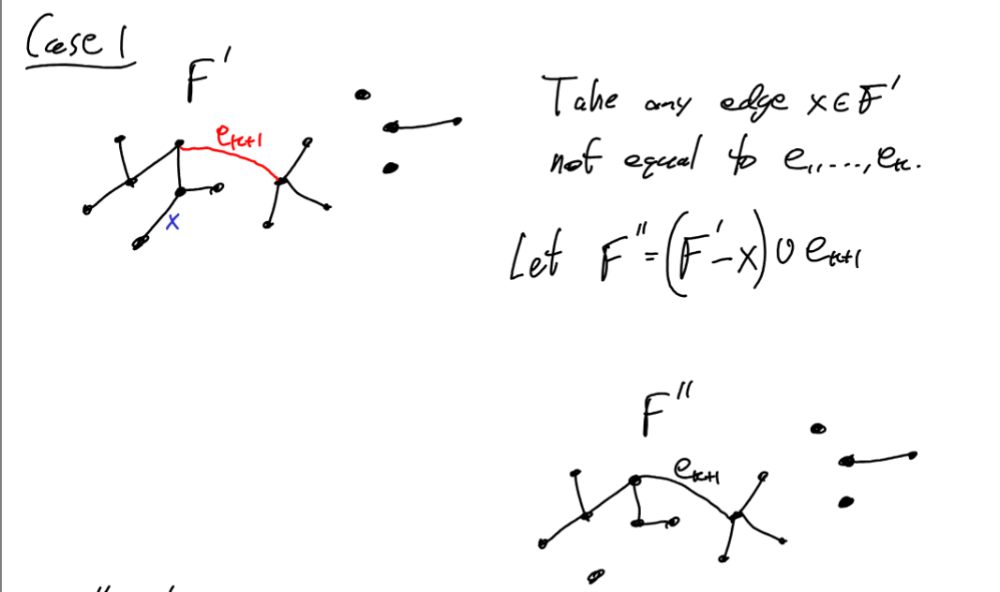

# Kruskals_Algorithm

Consider a graph G where each edge e has a "weight" w(e). We want to find a soanning tree of G whose total weight is as small as possible(or as large as possible).

Input: A connected graph G wher each edge $e \in E(G)$ has a weight $w(e)\ge 0$. Say |V(G)| = n 

Output: A spanning tree T whose total weight is as small as possible.

Begin:

Initial step: Let $F_0$ be the forest with vertices V(G) and no edges.

Iteration Begins

1. We have a forest $F_i \sub G$ with n vertices and i edges and n-i connected components
2. If i=n-1, then halt and output $F_i$ as a minimum-weight spanning tree.

3. If $i \lt n-1$, then among all edges which connect two trees in $F_i$ pick $e_i+1$ whose weight is the smallest

4. Let $F_i+1 = F_i \cup \{e_{i+1}\}$

5. Return to step 1

## Theorum

Kruskel's algorith actually does output a minimum-weigth spanning tree.

## Proof

By **induction** on i we will **prove** that at iteration i $F_i$ is a forest in G with i edges and minimum possibole weight among all forests with i edgse

### Base case i = 0
$F_0$ has weight 0 and is clearly a min-weigth forest with 0 edges.

### Induction Step
**Assume** that for $\set{F_0, F_1, F_2, ..., F_i}$ are all minimum weight forests with the appropriate number of edges.

**Show** that $F_i$ is also a min-weight forest with i+1 edges.

The edges of $F_i$ are $\set{e_1, e_2, e_3, ... e_i}$ where $e_j$ is added at iteration j

Each edges added at a later step was available to add an earlier step. 

so $w(e_1)\le w(e_1)\le ... w(e_i)$, because we are choosign the smallest-weighted edge that is available at each step.

**Now suppose** that $w(F_{i+1}) = w(e_1) + w(e_1)+... w(e_i)$ is not a smallest-weighted forest with i+1 edges.

**Let F\`** be a forest with i+1 edges such that $w(F`) \lt w(F_{i+1})$.

Among all such forest F\` chose the one which has edges $e_1, e_2, ... , e_k \in F`$ where k is as large as possible

**Consider** now edge $e_{k+1} \notin F`$ but is in $F_{i+1}$. Either $e_{k+1}$ connects two components of F\` togther (case 1) or $e_{k+1}$ has both endpoints in the same connected component of F`

