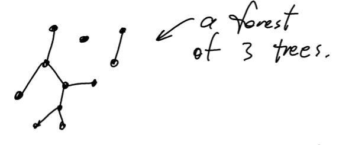
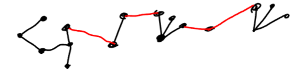

# Terms
**Connected and UV-path**  
Definition: A graph $G$ is connected when for every pair of vertices $u,v \in V(g)$, there is a path from u to v. Such a path is often abbreviated as a uv-path

**Tree**

Definition A tree is a connected graph without any cycles.

**Leaf**

Definition: A leaf in a tree T is a vertex of degree 1

**Subgraph**

given a graph G a subgraph is a graph H for for which $ V(H) \subseteq V(G)$ and $E(H) \subseteq E(G)$. This relationship is denoted by $H \subseteq G$

**Spanning Tree**

Given a connected graph G a spanning tree is a subgraph $T \subseteq G$ which is a tree and for which $V(T) = V(G)$. (In other words T is a tree in G which covers all o fthe vertices in G.)

**Degree Sequences**

Definition: Given a simple lgraph $G$ with vertices $v_1,v_2,v_3, \ldots, v_n$ with $d(v_1) \ge d(v_2)\ge \ldots \ge d(v_n)$ the degree sequence of $G$

**Distance**  

Definition: The distance between two vertices $u,e \in V(G)$
(when G is connected) is the length of a shortest uv-path in G. This distance is denoted by $d_G(u,v)$.

**Breadth First Search (BFS)** 

Definition: is an algorithm for searching a tree data structure for a node/vertex that satisfies a given property

Input: A connected graph G and a root vertex $v\in V(G)$

Output: A spanning tree T of G rooted at v fpr which the length of the unique uv-path in T is $d_G(u,v)$ for all $u \in V(G)$. In other words BFS finds a shortest uv-path in G for all vertivse a and gives it to you int he form of a spannding tree

*Begin*

1. Let $T_0 = V$. This is a tree with one vertex where the furthest vertex from v has distance = 0.

2. Assume we hae $T_i$ which is a tree rooted at V whose vertices partition into i levels according there distance from V.

3. If $V(T_i) = V(G)$ then halt and return $T = t_i$ as a BFS spanning tree.

4. If $V(T_i) \sub V(G)$ then check each edge of G attached vertices at level i to obtain a new tree $T_i+1$ with $i+1$ levels.

    

5. Return to step 2.

Notice: BFS checks each edge in G at most pne time in its entire computation. So we say BFS has at most $|E(G)|$ edge checks.

**Forest**

Definition: A forest is a vertex-disjoin union of trees.Equivlantly a forest is a graph with no cycles

Note: A forest with k trees can be connected into one tree using k-1 edges. 

