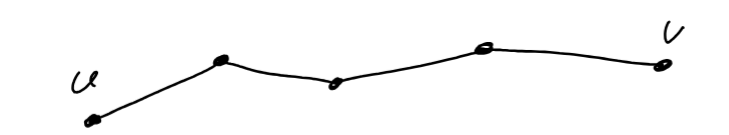

# Terms
**Connected and UV-path**  
Definition: A graph $G$ is connected when for every pair of vertices $u,v \in V(g)$, there is a path from u to v. Such a path is often abbreviated as a uv-path

**Tree**

Definition A tree is a connected graph without any cycles.

**Leaf**

Definition: A leaf in a tree T is a vertex of degree 1

**Subgraph**

given a graph G a subgraph is a graph H for for which $ V(H) \subseteq V(G)$ and $E(H) \subseteq E(G)$. This relationship is denoted by $H \subseteq G$

**Spanning Tree**

Given a connected graph G a spanning tree is a subgraph $T \subseteq G$ which is a tree and for which $V(T) = V(G)$. (In other words T is a tree in G which covers all o fthe vertices in G.)